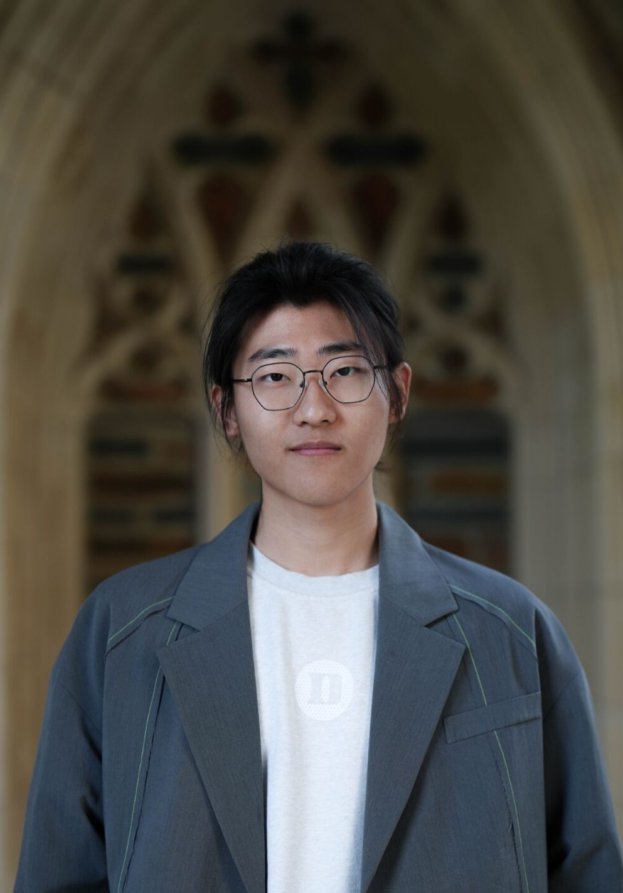

## Contact
zf2384@cumc.columbia.edu | 347-475-7976 |
[My Github](https://github.com/Bruce-Fann)

---

## Education

**Columbia University, Irving Medical Center** — *M.S. in Environmental Health Data Science*  
_New York, United States_ • *Expected Graduation: May 2026*  
- Relevant Courses: Data Science, Biostatistics, Molecular Epidemiology, Environmental Health Science  

**Duke Kunshan University (DKU)** — *B.S. in Environmental Science (Biogeochemistry)*  
_Kunshan, China_ • *Graduation: May 2025*  
- Relevant Courses: Applied Environmental Science & Policy, Global Change Biology, Biogeochemistry, Life Cycle Assessment  

---

## Professional Experience

**Guotai Junan Securities, Jiangsu Branch** — *Financial Products Department Intern*  
_Nanjing, China_ • *June – July 2024*  
- **Data Analysis:** Extracted and analyzed market and macroeconomic data from Wind Terminal; produced 10+ reports supporting client strategy.  
- **Research & Visualization:** Built dashboards and summarized investment trends for internal presentations.  
- **Collaboration:** Organized training sessions on financial modeling and quantitative tools for 10+ junior analysts.  

---

## Research Experience

**Foraging Ecology of Asian Dowitchers at Coastal Wetlands**  
_Core Research Member | Aug 2023 – Present_  
- **Behavioral Quantification:** Designed ethograms and used **BORIS** to analyze foraging behaviors from field videos.  
- **Statistical Modeling:** Applied **Python** to assess dietary preferences and habitat suitability.  
- **Scientific Communication:** Authored reports linking prey distribution with species-specific foraging strategies.  

**Lifecycle Assessment of Capsule Packaging Materials for Food Company**  
_Team Member | Sep – Dec 2024_  
- **LCA Modeling:** Compared environmental impacts of **PP**, **PLA**, and aluminum capsule materials to identify sustainable alternatives.  
- **Data Integration:** Collected and harmonized datasets from *ecoinvent*, ESG reports, and literature; built cradle-to-grave models in **OpenLCA**.  
- **Quantitative Analysis:** Used **R** and **Excel** to visualize global warming potential and water use; found **PLA** performed best overall, with raw material extraction as the key emission source.  

---

## Leadership & Service

**Student Interconnection Organization (Co-founder)** — *Duke Kunshan University*  
_June 2022 – May 2023_  
- Co-founded a cross-cultural organization; led the Activity Department and organized DKU’s first campus cultural exhibition (now an annual event).  

**Environment Club (President)** — *Duke Kunshan University*  
_Jan – May 2023_  
- Led sustainability-themed events integrating art, ecology, and media; coordinated lectures, documentary screenings, and upcycling workshops.  

---

## Additional Information

- **Languages:** English (Fluent, TOEFL 106; GRE 328), Mandarin Chinese (Native)  
- **Technical Skills:** R, Python, Github, Microsoft Office, OpenLCA, Arc Gis  
- **Research Interests:** Environmental data analysis, sustainability policy, ecological modeling  
- **Interests:** Guitar, Badminton, Dance

---

 

You could also view or download the PDF version here。

[Click to check resume (PDF)](Bruce_Fan_Resume.pdf)

<!-- nice little button -->
<a href="Bruce_Fann_Resume.pdf" target="_blank" style="background-color: #007bff; color: white; padding: 10px 20px; text-decoration: none; border-radius: 5px;">
  Download Resume PDF
</a>

